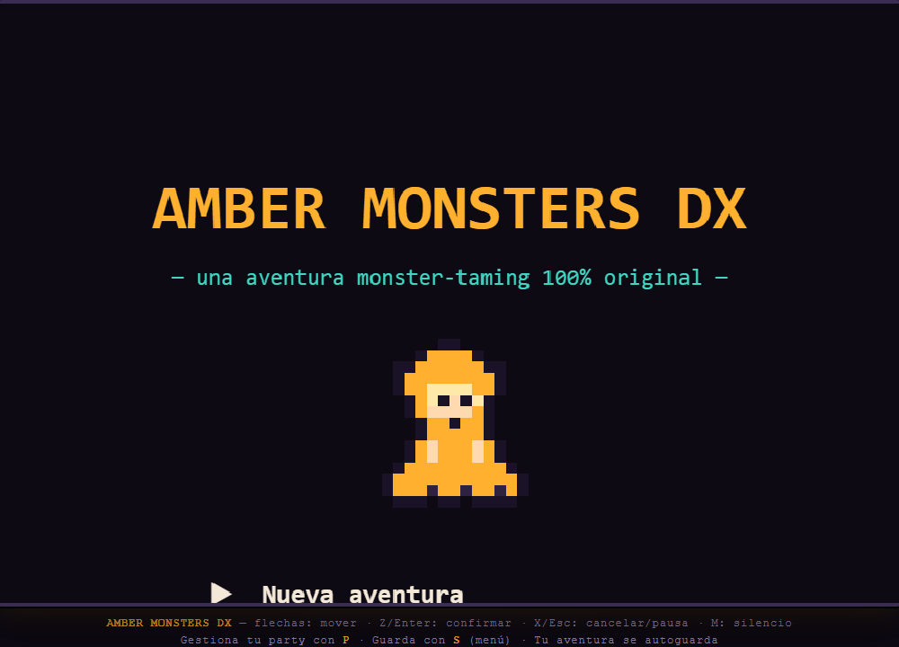
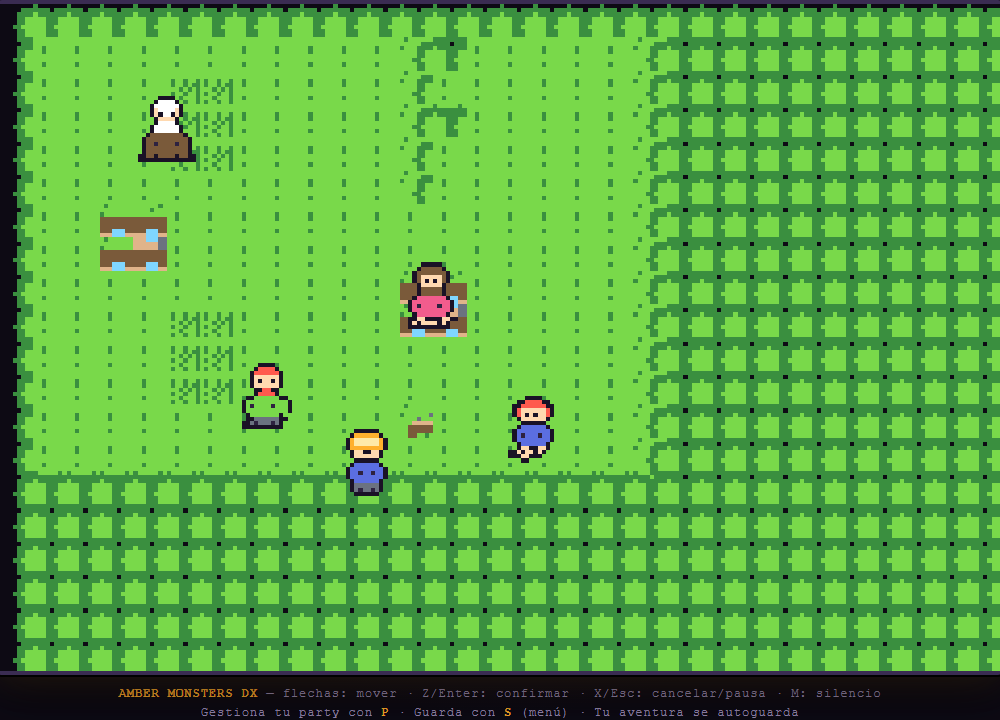
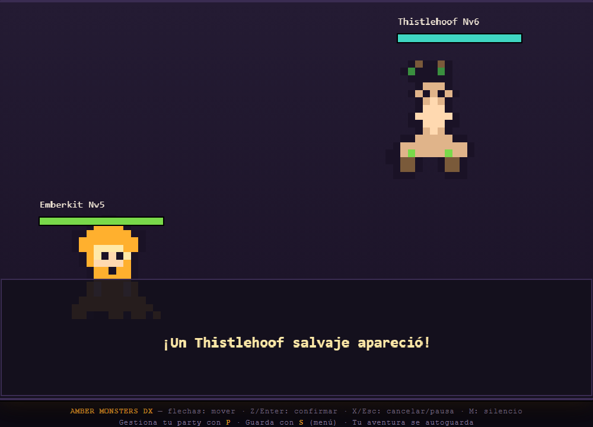
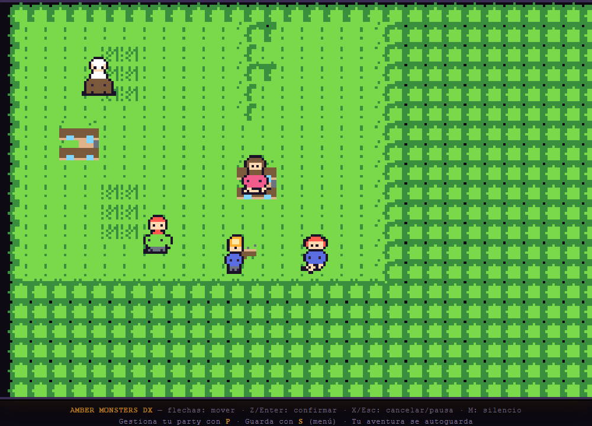

# 🟠 Amber Monsters DX

RPG de captura de criaturas estilo Game Boy en el navegador. **100% original**:
código, sprites pixel-art y música procedural — sin assets externos, sin licencias.



## Cómo jugar

```bash
npm install
npm run dev        # → http://localhost:5173
```

| Tecla | Acción |
|---|---|
| Flechas / WASD | Moverse |
| Z / Enter | Confirmar / hablar / atacar |
| X / Escape | Cancelar / cambiar menú de batalla |
| P | Menú party (usar pociones) |
| S | Guardar partida |
| M | Silenciar música |

## El juego

- **3 mapas**: Aldea Ámbar, Ruta 1 y Cueva Ópalo, con NPCs, puertas y transiciones.
- **6 criaturas salvajes + 2 evoluciones**: Emberkit→Pyrelinx, Dewpup, Thistlehoof,
  Wispit, Gembit… cada una con sprites de batalla y overworld únicos (siluetas verificadas).
- **Combate por turnos** con 3 tipos (ember/thorn/aqua), efectividad, buffs,
  movimientos por nivel, XP, evolución, captura con orbes ámbar y huida.
- **Música y SFX procedurales** (Web Audio API): tema de aldea, ruta, cueva y batalla.
- **Guardado persistente** en localStorage.

## Capturas





## Verificación

```bash
npm run test:unit   # 21 tests: criaturas, batalla, tilemap, sprite gate
npm run test:gates  # 7 gates e2e (Playwright): visual, gameplay, audio
npm run build       # build de producción
```

- **Sprite gate**: ningún sprite vacío (≥30 px opacos), todos los índices de
  paleta válidos, todas las siluetas de criatura distintas.
- **Gates e2e**: título renderiza contenido real, nueva partida → mover →
  batalla → captura determinista, guardar/cargar, menú party, mute, AudioContext.

Detalles del proceso en [docs/process.md](docs/process.md).

## Estructura

```
src/
  core/     state, input, party, save
  world/    tilemap, world (movimiento, encuentros, NPCs)
  battle/   battle (turnos), capture (orbes)
  data/     creatures (sprites + stats + movimientos embebidos)
  sprites/  palette, renderer, tiles, characters
  audio/    audio procedural (BGM + SFX)
  ui/       renderer (canvas), ui (escenas/menús)
  main.js   game loop + API de debug (window.AMBER)
tests/
  unit/     vitest
  gates/    playwright
```

## API de debug (window.AMBER)

Usada por los gates e2e: `state()`, `newGame()`, `startBattle()`, `save()`,
`load()`, `clearSave()`, `healParty()`, `giveOrbs()`, `weakenEnemy()`, `winBattle()`.

## Licencia

MIT — código y arte originales. Hecho con la metodología de la skill
[`game-assets`](https://github.com/OpusGameLabs/game-creator) (matrices de paleta → pixel-art).
